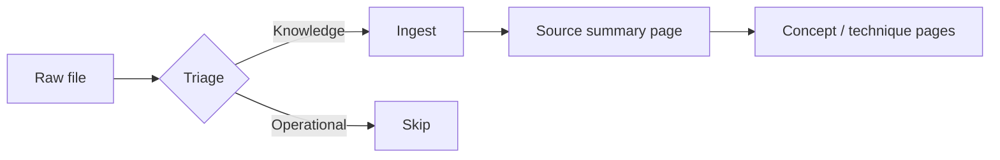
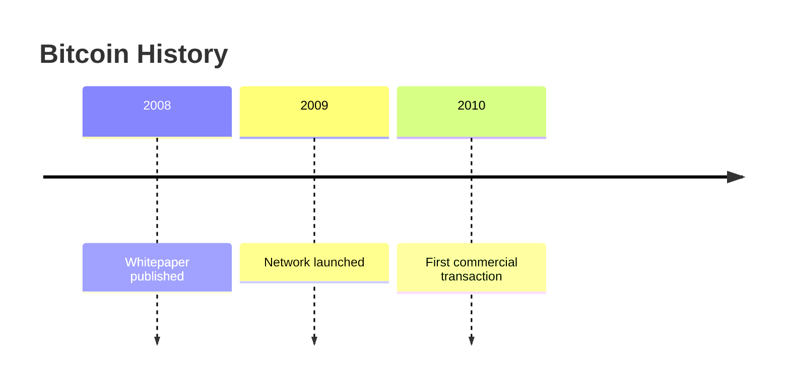

# llm-wiki-ingest

A cold-start playbook for ingesting raw source files into an llm-wiki. This skill covers everything from session startup through quality verification. Read it in full before taking any action.

---

## When to Use This Skill

- User drops a raw file into `raw/` and says "ingest this"
- User asks to process a new source, chapter, or article
- User asks to batch-process a directory of raw files
- User asks "what's been ingested?" or "which files haven't been processed yet?"
- User says "run the ingest for [domain/source]"

---

## Prerequisites

Before you can ingest, the following must exist:

- A wiki repo with at least a `CLAUDE.md` (or `WIKI.md`) schema file
- A `raw/` directory containing source files (or files to be converted into `raw/`)
- A `wiki/` directory with `index.md` and `log.md` (or the user is asking you to initialize them)

If `wiki/index.md` or `wiki/log.md` do not exist, ask the user before creating them. These are foundational files and their initial creation is a deliberate action.

---

## Mode Detection: Single-Wiki vs Monorepo

Before doing anything else, determine which mode you are in.

**Check for monorepo:** Does a file called `index.md` exist at the repo root (not inside `wiki/`)? AND do multiple subdirectories each contain their own `WIKI.md`? If both are true, you are in a monorepo.

**Single-wiki:** A single `CLAUDE.md` at the root governs the entire repo. There is one `raw/`, one `wiki/`, and no master router.

| Indicator | Monorepo | Single-wiki |
|-----------|----------|-------------|
| Root-level `index.md` exists | Yes | No |
| Multiple subdirs each have `WIKI.md` | Yes | No |
| Single `CLAUDE.md` at root | Shared methodology file | Entire schema |
| `raw/` location | Inside each domain subdir | At repo root |

---

## Session Startup Sequence

**CRITICAL: Do not skip this.** Every session starts cold. Read the schema before acting.

### Monorepo startup

1. Read `CLAUDE.md` (shared methodology, operations, conventions, rules)
2. Read `index.md` at repo root (master domain router — which domain owns which topic)
3. Identify the correct domain for the source being ingested using the routing rules in `index.md`
4. Read `<domain>/WIKI.md` (domain-specific page types, directory structure, source naming)
5. Now act

Skipping step 2 means you may create pages in the wrong domain or miss that a topic is already covered in another domain.

### Single-wiki startup

1. Read `CLAUDE.md` (the full schema: page types, directory structure, operations, rules)
2. Read `wiki/index.md` to understand what has already been ingested
3. Now act

---

## High-Level Ingest Workflow

Full details in [workflow steps below](#ingest-steps). Summary:

```
Step -1: Pre-flight assessment — inventory formats, detect unknowns, get user decision
Step 0:  Triage — classify each file, decide to ingest or skip
Step 1:  Read the raw file in full
Step 2:  Brief the user (single-source) OR process directly (batch)
Step 3:  Write or update the source summary page
Step 4:  Create or update concept/technique/design-problem/protocol pages
Step 5:  Update wiki/index.md
Step 6:  Update wiki/overview.md (if the source changes the high-level picture)
Step 7:  Append to wiki/log.md
```

**Step -1 is critical and non-negotiable.** Running a batch ingest without a pre-flight check means unknown formats may be silently skipped, unsupported formats may crash mid-batch, or subagents may invent conversions that produce garbage output. Always pre-flight.

---

## Single-Source vs Batch Mode

### Single-source mode (1 file)

- Brief the user on key takeaways (2-5 sentences)
- Ask if there is anything to emphasize or any angle to focus on
- Wait for user confirmation before writing wiki pages
- Run the ingest steps yourself in sequence

### Batch mode (3+ files, same source collection)

Use when:
- Files are chapters of one book
- User has already reviewed the source material
- User explicitly asks for batch processing

In batch mode:
- Skip the per-file briefing
- Spawn parallel edit agents (each handles a subset of files)
- Use a single consolidation agent for shared files (index.md, overview.md, log.md)
- Run a review agent after consolidation

See [agent-prompts.md](agent-prompts.md) for ready-to-use agent templates.

See [quality-gates.md](quality-gates.md) for the full edit → consolidate → review → fix pipeline.

---

## Ingest Steps

### Step -1: Pre-flight Assessment

Before any other work, inventory the target raw directory. This step is **mandatory** for batch ingests and **recommended** for single-source ingests.

**What to do:**

1. List every file in the target ingest scope (a single file, a directory, or multiple directories)
2. Group files by extension
3. Cross-check each extension against the supported formats table in `format-conversion.md`:

   | Supported (no prompt needed) | Known unsupported | Unknown |
   |---|---|---|
   | `.md`, `.mhtml`, `.mht`, `.html`, `.htm`, `.pdf` (text-based), `.srt` | `.epub`, `.docx`, `.pptx`, `.xlsx`, image formats without OCR, audio without transcription | Anything not in either column |

4. For each file, note:
   - Extension
   - File size (flag <500 bytes as likely empty stub)
   - Classification: supported / known unsupported / unknown

5. Produce a pre-flight report to the user:

```markdown
## Pre-flight Report

### Ready to ingest (N files)
- path/to/file1.md (12 KB)
- path/to/file2.mhtml (40 KB)

### Warning: likely empty stubs (N files)
- path/to/tiny-file.md (240 bytes) — under 500 bytes, may be auth-wall or template

### Unsupported format — needs decision (N files)
- path/to/book.epub — EPUB format, not covered by format-conversion.md
  Options: (a) skip, (b) add EPUB to the skill, (c) try generic pandoc conversion

### Unknown format — needs decision (N files)
- path/to/mystery.xyz — extension not recognized
  Options: (a) inspect with `file <path>`, (b) skip, (c) ask user what format this is
```

6. **STOP and wait for user decision** before proceeding if the report contains any files in the "needs decision" categories. Do not silently skip unknown formats. Do not invent conversions.

7. For single-source ingests where the format is obviously supported (e.g., user dropped a single `.md` file), the pre-flight can be a one-line sanity check rather than a full report. But do not skip it entirely.

**Why this step matters:** Without a pre-flight check, batch edit agents may silently skip unknown formats, or worse, invent conversions that produce garbage. The pre-flight is the only gate that catches format gaps BEFORE tokens are spent on ingest.

### Step 0: Triage

Classify the file BEFORE reading it in full. Read the filename and first 30 lines only.

| Class | Description | Action |
|-------|-------------|--------|
| Knowledge | Substantive technical/domain content | Proceed with ingest |
| Operational | Task lists, meeting notes, backlogs, deprecated docs, templates | Skip. Log the skip with reason. |
| Non-domain | Software engineering content outside this wiki's scope | Recommend moving to a reference directory. Do not ingest. |
| Empty stub | Auth-wall HTML, template placeholders, <500 bytes | Skip. Flag for re-capture if important. |

Triggers that strongly suggest skipping:

- Filename contains: "backlog", "todo", "research-plan", "draft", "deprecated", "meeting", "retro"
- First 30 lines contain only: section headers with no content, template placeholders, `@mentions` with no substance
- File size under ~500 bytes
- Content contains: "Update your profile", "Check your email", "Sign in to continue" (auth-wall)
- Career/resume/salary articles in a technical wiki

When uncertain, ask the user. Do not silently skip files the user may want.

### Step 1: Read the raw file in full

Read the entire source file before writing anything. If the file contains images, use the two-step approach: read markdown text first, then view referenced images separately.

If the format is not already markdown, convert it first. See [format-conversion.md](format-conversion.md).

### Step 2: Brief or process

**Single-source:** Summarize the key takeaways in 2-5 sentences. Ask the user if there is anything to emphasize. Wait for a response before writing pages.

**Batch:** Skip briefing. Process directly. The review agent verifies alignment after the batch.

### Step 3: Write or update the source summary page

Location: `wiki/source-summaries/` (or the subdirectory specified in the domain's `WIKI.md`).

Filename: Mirror the source file name in kebab-case. Drop chapter number prefixes. Examples:
- `01. What is an OOD Interview.md` → `what-is-an-ood-interview.md`
- `Design A Rate Limiter.html` → `design-a-rate-limiter.md`
- `kafka-consumer-groups.mhtml` → `kafka-consumer-groups.md`

If the page already exists, update it: add the new source to `sources` frontmatter, update `updated` date, enrich content from the new source.

Source summary structure:
1. One-paragraph abstract
2. Key takeaways (bullet list)
3. Main content (sections matching the source's structure)
4. Connections (links to related wiki pages with one-sentence explanation)
5. Sources section

### Step 4: Create or update type-specific pages

Identify every significant concept, technique, design problem, or protocol in the source. For each:

1. Check `wiki/index.md` to see if a page already exists.
2. If a page exists: update it. Add the new source to `sources` frontmatter. Update `updated` date. Enrich the content. Do not duplicate what is already there.
3. If no page exists AND the item is significant enough: create it using the correct page type for the domain.

**Page type is determined by the domain's `WIKI.md`.** Common types across domains:

| Type | Used for |
|------|---------|
| `source-summary` | One raw source file |
| `concept` | A single concept, principle, or mechanism |
| `technique` | A systematic approach, framework, or method |
| `design-problem` | A single design problem or case study |
| `protocol` | A specific protocol, system, or token standard |
| `comparison` | Compares 2+ alternatives (concepts, techniques, products); MUST have `llm_generated: true` in frontmatter; lives under `wiki/comparisons/` |
| `overview` | High-level synthesis of the entire knowledge base |
| `entity` | A person, organization, place, product, or event — collects facts across multiple sources; requires `entity_type: person \| organization \| place \| product \| event` in frontmatter; natural target for timeline sections |
| `synthesis` | LLM-composed content drawing from 3+ sources or wiki pages; MUST have `llm_generated: true` in frontmatter; lives under `wiki/syntheses/` |

Note: `entity` pages may be human-authored or LLM-assisted. `synthesis` and `comparison` pages are always `llm_generated: true`. Do NOT set `llm_generated` on entity pages.

#### Entity page structure

Entity pages require a consistent structure. Use this template:

```markdown
---
title: <Entity Name>
type: entity
entity_type: person | organization | place | product | event
aliases: []                    # optional alt names / abbreviations
created: YYYY-MM-DD
updated: YYYY-MM-DD
sources:
  - raw/path/to/source.md
tags:
  - lowercase-hyphenated
related:
  - [[related-page]]
---

# <Entity Name>

One-paragraph abstract: who or what this entity is, and why it matters to this wiki.

## Key Facts

- Fact 1 (date, affiliation, role, or other stable data point)
- Fact 2
- … (aim for 5–10 bullets; more detail belongs in Timeline or body sections)

## Timeline

- **YYYY** — event
- **YYYY** — event

(Use a nested bullet list for simple timelines. For 4+ milestones, prefer Mermaid `timeline` type — see Rich Content Forms section.)

## Connections

- [[related-page]] — one-sentence reason for the connection

## Sources

- `raw/path/to/source.md`
```

**`entity_type` values:** `person | organization | place | product | event`. If the subject does not fit cleanly (e.g., an award, a movement, a community), use the closest match and add a note in the abstract. Do not invent new `entity_type` values.

Prefer updating existing pages over creating new ones. 96 newsletter articles do not become 96 pages. Consolidate by topic.

**Page count heuristics (from real session data):**

| Source size | Expected page count | Notes |
|-------------|---------------------|-------|
| Single technical chapter or article (~5-20 pages of prose) | 1 source summary + 2-5 concept/technique pages | Typical book chapter or a focused blog post |
| Worked design problem chapter | 1 source summary + 1 design-problem page + 0-2 new concepts | Concepts are usually already covered |
| Long-form reference (whitepaper, comprehensive guide) | 1 source summary + 5-12 supporting pages | Multiple distinct topics warrant separate pages |
| Newsletter article (short, focused) | Update 1-2 existing pages; create 0-1 new pages | Most newsletters are reformulations of established concepts |
| Multi-part series (e.g., "Crash Course in Caching Part 1/2/Final") | ONE thematic source summary covering all parts | Do not create one summary per part |
| Book (full technical book, many chapters) | Batch ingest one chapter at a time, 1 summary per chapter | See patterns.md for book ingest workflow |

**Red flags:**
- Creating more than 10 pages from a single source — likely over-fragmenting. Reconsider consolidation.
- Creating fewer than 2 pages from a 10,000-word source — likely under-capturing. Re-read for missed topics.
- Creating a new concept page for a term mentioned once in passing — not significant enough. Skip it.

### Step 4.5 Update Backlinks

Wikilinks are bidirectional in intent but unidirectional in syntax.
After creating or updating a page P, actively sync inbound links.

**Two directions to handle — handle BOTH:**

**Direction 1 — Existing pages that reference P (inbound sync):**
1. Scan `wiki/index.md` and every page you touched this session for
   frontmatter `related:` lists that mention P.
2. For each page Q that lists P in `related:`, ensure P's Connections
   section has a bullet pointing back to Q (if not already).

**Direction 2 — New page P references existing pages (outbound sync):**
3. When you CREATE a new page P that mentions pre-existing pages R₁, R₂, … in its body prose, for each Rₙ mentioned for the first time:
   - Add Rₙ to P's `related:` frontmatter (if not already there)
   - Add a backlink bullet in Rₙ's Connections section pointing to P
   - If Rₙ lacks a `related:` field entirely, add it before appending P to the list

Rules:
- Backlinks are only added to the **Connections** section, never to body prose.
- Each backlink is one bullet: `- [[page-name]] — one-sentence reason`.
- If P already has a backlink to Q, do not duplicate.
- If the connection is weak (tangential), do not force it.
- If a target page's frontmatter has no `related:` field at all, add `related:\n  - [[new-page]]` rather than skipping the update.

Batch mode: defer backlink sync to the consolidation phase (see
quality-gates.md) so parallel edit agents do not race on shared pages.

### Step 5: Update wiki/index.md

Every new page must appear in `wiki/index.md` exactly once, with a one-line specific description. Every modified page's description should be updated if the content changed substantially.

Do not let the index fall out of sync. Add entries immediately.

### Step 6: Update wiki/overview.md

Update `overview.md` only if the new source materially changes the high-level picture: introduces a new topic area, adds a whole new category of pages, or revises a major claim. Do not update overview for every incremental ingest.

### Step 7: Append to wiki/log.md

The log is append-only. Never edit existing entries. Append at the bottom.

Log entry format:
```markdown
## [YYYY-MM-DD] ingest | Title of source
Pages created: [[page-name]], [[page-name]]
Pages updated: [[page-name]], [[page-name]]
Notes: One sentence on anything notable about this ingest.
```

Pages first created in this ingest go under `Pages created`. Pages that already existed and were modified go under `Pages updated`.

---

## When to Branch to format-conversion.md

If the raw file is not already in markdown format, go to [format-conversion.md](format-conversion.md) before Step 1.

Formats requiring conversion:

| Format | Extension | Convert before ingesting |
|--------|-----------|-------------------------|
| MHTML / MHT | `.mhtml`, `.mht` | Yes |
| HTML | `.html`, `.htm` | Yes |
| PDF | `.pdf` | Yes (text-based PDFs only) |
| SRT (subtitles) | `.srt` | Yes |
| Markdown | `.md` | No — ready to ingest |

---

## When to Use quality-gates.md

Use [quality-gates.md](quality-gates.md) for:

- Any batch ingest of 3+ files
- After any ingest where you created 5+ new pages
- When the user asks for a quality check
- When you suspect a race condition (parallel agents touching shared files)
- After a fix agent runs

---

## When to Read ISSUES.md

[ISSUES.md](ISSUES.md) tracks known limitations and untested assumptions of this skill. **Read it before trusting anything in this skill.**

Key entries a fresh session must be aware of:
- The skill is untested in production by anyone except the session that wrote it
- 11 of the 19 TEST.md scenarios are based on memory, not validated by actual test runs
- The skill is large (~3,300 lines) and subagents may skim rather than read in full
- No versioning/changelog yet

When you encounter a new problem:
1. Check ISSUES.md for an existing entry
2. If none, add a new entry with severity + workaround + resolution path
3. When a real test validates an issue, move it to the Resolved section

ISSUES.md is institutional memory. Treat it as a "known debts" register.

## When to Use TEST.md

[TEST.md](TEST.md) contains 8 validation scenarios that the skill must handle. Run these whenever you modify this skill:

- After non-trivial edits to any skill file
- Before sharing the skill with another user
- When a real ingest fails in a way the skill should have prevented — add the new failure as a new scenario
- Periodically as a regression check

Each scenario has: setup instructions, a cold-start prompt template, expected behavior, pass criteria, and the specific gap it was created to catch. Every scenario traces to a real failure observed during skill development — no speculative tests.

**When a scenario fails:** Fix the skill, not the test. Re-run the failed scenario to confirm the fix. Run Scenario 1 as a smoke test to catch regressions.

## When to Use agent-prompts.md

Use [agent-prompts.md](agent-prompts.md) when:

- Spawning a batch edit agent to process a subset of files
- Spawning a consolidation agent to update shared files
- Spawning a review agent to verify quality
- Spawning a fix agent to address review findings

---

## Page Conventions (Universal)

These apply to all wikis regardless of domain.

### Frontmatter (every page must have this)

```yaml
---
type: source-summary | concept | technique | design-problem | protocol | comparison | overview | entity | synthesis
llm_generated: false  # set true ONLY for synthesis and comparison pages
sources:
  - domain/raw/path/to/source.md
created: YYYY-MM-DD
updated: YYYY-MM-DD
tags:
  - lowercase-hyphenated
related:
  - [[other-page]]
---
```

All six fields are required. `sources` uses paths relative to the repo root. `type` must match the subdirectory the page lives in.

**Date awareness (CRITICAL for subagents):** The `created` and `updated` fields must reflect TODAY'S actual date, not a date copied from an example in this skill or from an existing wiki page. Subagents are especially prone to this error — they see `2026-04-11` in an example and blindly copy it, resulting in every newly-created page carrying a stale date.

Rules:
- Before writing any page, determine today's date (check the system date, the session context, or ask the user if uncertain)
- For NEW pages: both `created` and `updated` = today
- For UPDATED pages: leave `created` as-is, set `updated` = today
- Never copy a date from an example in this skill file — those are templates, not data
- If a subagent is unsure of the current date, it must ASK the orchestrator rather than guess or copy an example date

When spawning edit/consolidation/review agents, always include `TODAY'S DATE: <actual date>` in the prompt. See [agent-prompts.md](agent-prompts.md) — every template has a `{{TODAY}}` placeholder for this reason.

### File naming

Kebab-case. Descriptive. No spaces. No chapter number prefixes in wiki filenames.

**Slug collision warning:** If a raw source file shares a name with a significant concept/technique that will also get its own page (e.g., a `retry-pattern.md` raw file that introduces the Retry Pattern as a technique), naming the source summary `retry-pattern.md` will collide with the technique page `retry-pattern.md` in another subdirectory. Obsidian wikilinks are filename-based and this creates ambiguity.

Resolution rules:
1. Source summaries take priority for the base name only if the source covers ONE topic with the same name as the source (e.g., the source is literally titled "Retry Pattern" and discusses only retry)
2. Otherwise, suffix the source summary: `-guide`, `-article`, `-chapter`, or use the full article title in kebab-case (e.g., `a-guide-to-retry-patterns.md`)
3. Never create two wiki pages with the same base filename in different subdirectories

### Index and Log Frontmatter

`wiki/index.md` and `wiki/log.md` are themselves wiki pages and need frontmatter. They are the only pages where `sources` can be empty.

```yaml
# For index.md
---
type: overview
sources: []
created: YYYY-MM-DD
updated: YYYY-MM-DD
tags:
  - index
  - catalog
related: []
---
```

```yaml
# For log.md
---
type: overview
sources: []
created: YYYY-MM-DD
updated: YYYY-MM-DD
tags:
  - log
  - operations
related: []
---
```

`overview.md` at the wiki root uses `type: overview` with a populated `sources` field listing every raw source the wiki draws from.

### Internal linking

Use Obsidian wikilinks `[[page-name]]` for all cross-references. Do not use markdown link syntax `[text](path)` for internal links. Link on first mention in each page. Do not link the same target more than once per page.

**Connections / Related section handling:** The "link on first mention, don't link twice" rule creates a natural tension with the bottom-of-page Connections or Related sections that the page structure guidelines specify. Resolution:

- In the BODY of the page, link `[[target]]` on first mention as normal
- In the bottom Connections/Related section, if the target was already linked in the body, include it anyway as a bare `[[target]]` followed by a one-sentence context note. The "don't link twice" rule is a guideline for running prose, not for structured navigation sections.
- The `related` frontmatter field is machine-readable — include every related page there regardless of what's in the body
- Obsidian and most Markdown renderers tolerate duplicate wikilinks; the rule exists to prevent noisy prose, not to break navigation

Rule of thumb: the Connections/Related section is a navigation index, not prose. It can repeat wikilinks already shown in the body.

### Rich Content Forms

Use richer formatting when it genuinely aids comprehension — not to decorate.

**Mermaid diagrams**

Use for: process flow (`flowchart`), sequence interactions (`sequenceDiagram`), state machines (`stateDiagram`). Always place inside a fenced code block tagged `mermaid`.



When to use: the flow has 3+ steps or branches that prose would obscure. When NOT to use: a single-sentence description covers the whole thing.

**Comparison tables**

Use when comparing 3+ options across 3+ dimensions. Markdown table format:

| Dimension | Option A | Option B | Option C |
|-----------|----------|----------|----------|
| Latency | Low | Medium | High |
| Throughput | Medium | High | Low |
| Durability | Strong | Eventual | Strong |

When to use: evaluating trade-offs where a reader needs to scan rows and columns. When NOT to use: fewer than 3 meaningful dimensions — prose or a bullet list is clearer.

**Timeline sections**

Ideal for `entity` pages (person, organization, event). Use a nested bullet list with dates for simple timelines:

- **2008** — Bitcoin whitepaper published by Satoshi Nakamoto
- **2009** — Genesis block mined; Bitcoin network live
- **2010** — First real-world transaction (10,000 BTC for two pizzas)

For richer timelines, use Mermaid's `timeline` type:



When to use: the entity has 4+ dated milestones that matter to understanding it. When NOT to use: fewer than 4 events, or dates are not central to understanding the entity.

**When NOT to use rich content**

- Do not add a diagram if a sentence works just as well.
- Do not copy-paste a 20-row table if 3 rows illustrate the point.
- Do not use Mermaid for anything that plain prose handles in two lines.
- Rich content that does not add signal beyond the text is noise — omit it.

### Sources section

Every page must end with:
```markdown
## Sources

- `domain/raw/path/to/source.md`
```

Use paths relative to the repo root.

### No emoji in wiki pages

Use `Warning:` as a plain text prefix for uncertain claims. Not a warning symbol, not a caution sign — just the word `Warning:`.

### Backtick generic types

CRITICAL: Generic types like `List<Integer>`, `Map<K, V>`, `Optional<T>` MUST be wrapped in backticks. Without backticks, markdown/Obsidian interprets `<Integer>` as an HTML tag and silently breaks rendering. This is easy to miss and breaks pages in ways that are hard to diagnose.

---

## Critical Non-Negotiables

1. **Never modify raw/.** These are immutable source of truth. One-time setup operations (stripping Notion UUIDs, moving misplaced files) are the ONLY exception and must be explicitly approved by the user.
2. **Every claim must trace to a raw source.** No inserting general knowledge. Mark uncertain claims `[UNVERIFIED]`.
3. **Contradictions must be flagged explicitly.** Never silently overwrite a claim. Add a Contradictions section with both claims and their sources.
4. **The log is append-only.** Never edit existing entries. If a prior entry needs correction, APPEND a note entry explaining the correction.
5. **The user directs.** Do not ingest, create pages, or restructure without the user asking.
6. **Prefer updating existing pages** over creating new ones. Check `wiki/index.md` before creating.
7. **Proprietary content stays in source summaries.** Company-specific names (e.g., internal project names) should be generalized in concept/technique/protocol pages. Source summary pages may retain proprietary names since they describe a specific source.
8. **Raw file paths must stay as written in the `sources` frontmatter.** Even if the path contains spaces, UUIDs, or internal directory names — the source path must be literally correct so that raw files can be re-located.
9. **Synthesis and comparison pages must set `llm_generated: true`** in frontmatter. This preserves the human-vs-LLM provenance distinction Karpathy emphasizes.
10. **Backlinks must be bidirectional.** If page A lists B in `related:` or body wikilinks, B must list A in its Connections section. Step 4.5 enforces this.

---

## Advanced Patterns

For specialized workflows, branch to [patterns.md](patterns.md):

| Pattern | When to use |
|---------|-------------|
| **Newsletter consolidation** | Ingesting 20+ related articles (e.g., blog/newsletter archive). One thematic summary per topic, not one per article. |
| **Notion export handling** | Raw files are a Notion workspace export (UUIDs in filenames, deeply nested dirs, co-located images). Requires UUID stripping and triage. |
| **Cross-domain meta-wiki** | Topics span multiple domains in a monorepo. Create comparison pages that synthesize across wikis using `wiki:` prefix source citations. |
| **Monorepo restructuring** | A single wiki has grown to cover 5+ unrelated domains. Split into a monorepo with a master router and per-domain sub-wikis. |
| **Verification script** | User wants regular automated health checks. Provides a bash script that validates frontmatter, wikilinks, index, sources. |

---

## Orchestrator vs Subagent Roles

When running this skill in Claude Code:

**Orchestrator (the main agent, with user context):**
- Reads the schema and index
- Decides single-source vs batch mode
- Decides how to split a batch across parallel edit agents
- Spawns subagents with clear, complete prompts
- Presents results to the user and handles decisions

**Subagents (spawned via Agent tool):**
- Execute the actual ingest work
- Return reports with exact file paths
- Do not negotiate scope with the user — their task is fixed at spawn time

For any batch of 3+ files, the orchestrator should NOT do the ingest itself. Spawn parallel edit agents. This isolates context and parallelizes work.
